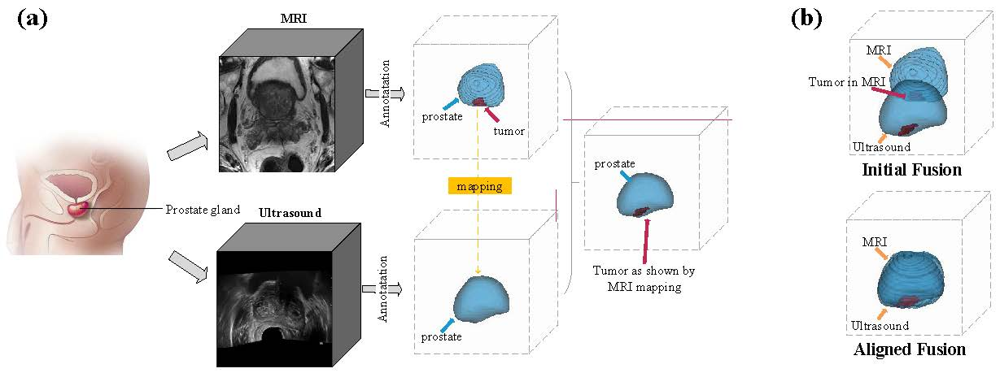
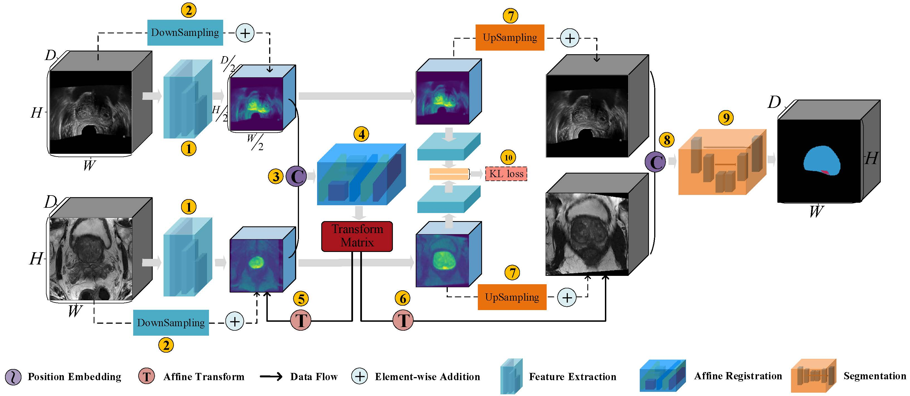
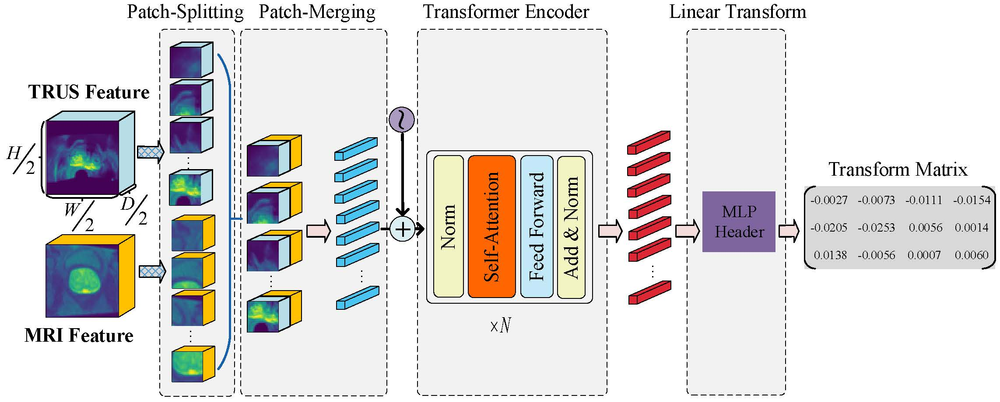
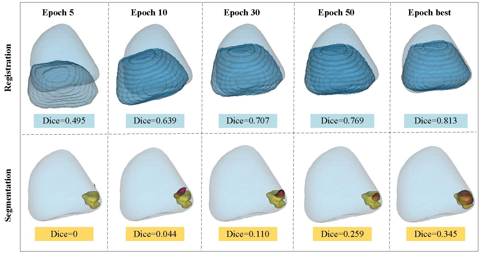

# AlignSegNet
This is the source code for paper **AlignSegNet: Registration-Enhanced Segmentation of Prostate Cancer in B-mode Ultrasound Images**
**AlignSegNet** is an end-to-end deep learning framework that jointly learns image registration and segmentation to accurately localize prostate anatomy and cancerous lesions in real‑time ultrasound (TRUS) by leveraging pre‑acquired MRI information.

<div align=center></div>
  <figcaption style="text-align:left; font-size:0.85em; line-height:1.4;">
    <small>
      <strong>Figure 1. Illustration of the MRI–TRUS fusion‑guided biopsy and data fusion.</strong>  
      (a) Illustration of the MRI–TRUS fusion‑guided biopsy workflow. (b) Illustration of MRI–TRUS image fusion using different strategies.
    </small>
  </figcaption>

<div align=center></div>
<p align="left"> 
The overview of our method. 
</p>

# AlignSegNet


---

## 🚀 Core Contributions

1. **Early Spatial Alignment**  
   Instead of naïve channel‑wise fusion, AlignSegNet applies an affine registration module upfront to bring MRI and TRUS into a common space, reducing misalignment and enabling more effective information sharing.

2. **Joint Optimization**  
   A unified network trains registration and segmentation simultaneously. The registration module refines the fusion quality, while the segmentation branch benefits from better‑aligned inputs, yielding superior accuracy and stability.

3. **Modular Design**  
   Both registration and segmentation components are interchangeable, allowing easy adaptation to other multimodal medical imaging tasks.

---

## 🖼️ Figure Walkthrough

### Figure 1: MRI–TRUS Fusion Workflow and Motivation  
<div align="center">
  
</div>

**Description:**  
- **(a)** Clinical workflow: a radiologist first segments the prostate and lesion on MRI, then maps that annotation onto live TRUS for targeted biopsy.  
- **(b)** Naïve fusion (top) fails when anatomical structures are misaligned. Applying AlignSegNet (bottom) yields well‑co‑localized prostate boundaries and lesions across both modalities.

---

### Figure 2: End-to-End AlignSegNet Architecture  
<div align="center">
  
</div>

**Description:**  
1. **Feature Extraction:** Dual CNN backbones extract modality‑specific features.  
2. **Feature Fusion & Registration:** Pooled features are concatenated and fed into a Transformer‑based registration head that predicts a 3×4 affine transformation matrix.  
3. **Warping & Refinement:** The predicted affine transform aligns the raw MRI and TRUS, whose features are then fused, upsampled, and passed to the segmentation branch.  
4. **Segmentation:** A U‑Net decoder yields the prostate and lesion masks on the TRUS image.

---

### Figure 3: Registration Module Details  
<div align="center">
  
</div>

**Description:**  
- **Input:** Concatenated MRI+TRUS feature patches.  
- **Transformer Encoder:** Multiple layers capture global context and predict the affine parameters via an MLP head.  
- **Output:** A 3×4 matrix that aligns the two modalities before segmentation.

---

### Figure 7: Training Dynamics of Registration and Segmentation  
<div align="center">
  
</div>

**Description:**  
- **Top Plot:** Prostate registration Dice score improves from ~0.50 to ~0.81 across epochs.  
- **Bottom Plot:** Lesion segmentation Dice score climbs from zero (pre‑alignment) to ~0.35, demonstrating the synergistic benefit of joint training.

---

## 📦 Quick Start

1. **Clone the repository & install dependencies**  
   ```bash
   git clone https://github.com/yourusername/AlignSegNet.git
   cd AlignSegNet
   pip install -r requirements.txt


## Requirements
* albumentations==1.0.0
* inplace_abn==1.1.0
* matplotlib==3.4.2
* numpy==1.22.2
* opencv_python_headless==4.5.2.54
* pretrainedmodels==0.7.4
* segmentation_models_pytorch==0.2.0
* torch==1.8.0
* torchvision==0.9.0

## Data
In order to make it easier for the readers to reproduce and understand the code, I have provided a small amount of example data used in our experiment under the **dataset** folder, where provides six training, validation and test images.

## File declaration


**main.py**: The codes for training, validating and testing.

## Run the codes
Install the environment.
```bash
pip install -r requirements.txt
```

Train and test the model.
```bash
python main.py
```
